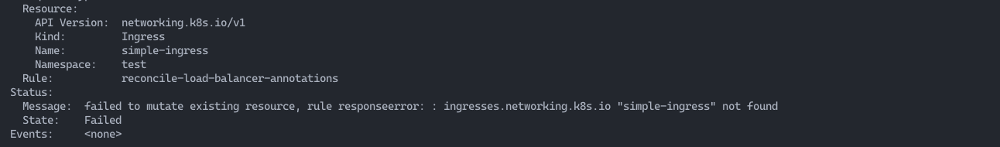
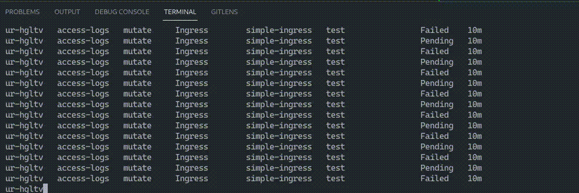

> An image of the error: failed to mutate existing resoure...

## Observing Odd Behavior

During due dilligence checks in a test Kubernetes (k8s) environment, I encountered
unexpected behavior when analyzing `UpdateRequest` (UR) resources connected to a
`MutateExisting` policy. When the policy was applied in isolation, it worked as
expected, however, when placed in a CI/CD pipeline of quick verification checks
where resources were stood up and torn down methodically, Kyverno appeared to
get "stuck."

## Infinitely Flipping States



I uncovered an infinite loop of `Pending` and `Failed` `UR` states.
Immediately I suspected some sort of race condition, whereby the quick
deletion of the the K8s resource obstructed Kyverno's ability to process its
mutation.

## The Policy

The policy related to the `URs`, was created to ensure that Ingress resources
had requisite annotations at all times, regardless of when the resource was
created.

### Mutating Resourses with JMESPath

While there is nothing necessarily unique regarding the policy I developed;
theoretically, any `MutateExisting` policy applied in a similar manner should
cause the inifinite loop bug.

Kyverno is an incredibly powerful tool, and with JMESPath you can accomplish a
great deal. The Policy in question aligned with annotations found in the
[AWS Load Balancer Controller docs](https://kubernetes-sigs.github.io/aws-load-balancer-controller/v2.7/guide/ingress/annotations/).

Demo code pulled from my [GitHub Bug Report](https://github.com/kyverno/kyverno/issues/7882):

```yaml title="access-logs.yml"
apiVersion: kyverno.io/v1
kind: ClusterPolicy
metadata:
  name: access-logs
spec:
  mutateExistingOnPolicyUpdate: true
  rules:
  - name: reconcile-load-balancer-annotations
    context:
    - name: nestedMetadata
      variable:
        value: "request.object.metadata"
    - name: ingNamespace
      variable:
        jmesPath: "{{ nestedMetadata }}.namespace"
        default: ""
    - name: ingName
      variable:
        jmesPath: "{{ nestedMetadata }}.name"
        default: ""
    - name: lbAttributes
      variable:
        jmesPath: "{{ nestedMetadata }}.annotations.\"alb.ingress.kubernetes.io/load-balancer-attributes\""
        default: ""
    - name: s3Bucket
      variable:
        value: "access_logs.s3.bucket=test-bucket"
    - name: s3Enabled
      variable:
        value: "access_logs.s3.enabled=true"
    - name: s3Prefix
      variable:
        value: "access_logs.s3.prefix=test-prefix"
    match:
      any:
      - resources:
          kinds:
          - Ingress
    mutate:
      targets:
      - apiVersion: networking.k8s.io/v1
        kind: Ingress
        name: "{{ ingName }}"
        namespace: "{{ ingNamespace }}"
        preconditions:
          all:
          - key: "{{
                    lbAttributes |
                    (
                      contains(@, '{{ s3Bucket }}') &&
                      contains(@, '{{ s3Enabled }}') &&
                      contains(@, '{{ s3Prefix }}')
                    )
                  }}"
            operator: NotEquals
            value: true
      patchStrategicMerge:
        metadata:
          annotations:
            alb.ingress.kubernetes.io/load-balancer-attributes: |
            "{{
              lbAttributes |
              (
                contains(@, '{{ s3Bucket }}') && @ ||
                (
                  contains(@,'access_logs.s3.bucket') &&
                  regex_replace_all_literal('access_logs.s3.bucket[^,]+|$]', @, '{{ s3Bucket }}') ||
                  (
                    length(@) > `0` &&
                    join(',', ['{{ s3Bucket }}',@]) ||
                    '{{ s3Bucket }}'
                  )
                )
              ) |
              (
                contains(@, '{{ s3Prefix }}') && @ ||
                (
                  contains(@,'access_logs.s3.prefix') &&
                  regex_replace_all_literal('access_logs.s3.prefix[^,]+|$]', @, '{{ s3Prefix }}') ||
                  join(',', ['{{ s3Prefix }}',@])
                )
              ) |
              (
                contains(@, '{{ s3Enabled }}') && @ ||
                (
                  contains(@,'access_logs.s3.enabled') &&
                  regex_replace_all_literal('access_logs.s3.enabled[^,]+|$]', @, '{{ s3Enabled}}') ||
                  join(',', ['{{ s3Enabled }}',@])
                )
              )
            }}"
```

### Scripting and Breaking Things

Using a simple bash script, a cursory overview of the overarching issue was
replicated (using k3s):

```bash title="infinite-bug-demo.sh"
#!/usr/bin/env bash
set -Eeuo pipefail
die() {
kubectl delete namespace $namespace
  echo -e "$0" ERROR: "$@" >&2; exit 1;
}

# shellcheck disable=2154
trap 's=$?; die "line $LINENO - $BASH_COMMAND"; exit $s' ERR

namespace="test"

kubectl apply -f access-logs.yaml

kubectl apply -f - <<EOF
apiVersion: v1
kind: Namespace
metadata:
  name: test
EOF

kubectl apply --namespace $namespace -f - <<EOF
apiVersion: networking.k8s.io/v1
kind: Ingress
metadata:
  name: simple-ingress
spec:
  defaultBackend:
    service:
    name: alpaca
    port:
      number: 8080
EOF

sleep 1s

kubectl get ingress --namespace="$namespace" -o json | \
  jq -e '.items[]
    | .metadata.annotations."alb.ingress.kubernetes.io\/load-balancer-attributes"
    | . != null and contains("access_logs.s3.enabled=true") and contains("access_logs.s3.bucket") and contains("access_logs.s3.prefix")'

kubectl delete namespace "$namespace"

# Next review the UR and the logs from Kyverno's background controller.
# NOTE: make sure to delete the cpol access-logs before running this script again if you would like
# to reproduce the bug without errors from the script
# i.e. kubectl get ur -n kyverno, kubectl logs -n kyverno kyverno-background-controller-<hash>
# And later for reproducibility of the bug: kubectl delete cpol access-logs

# You should see logs like the following:
# I0721 19:20:51.694459 1 mutate.go:234] background/mutateExisting "msg"="cannot generate events for empty target resource" "policy"="access-logs" "rule"="reconcile-load-balancer-annotations"
# E0721 19:20:51.893001 1 labels.go:15] "msg"="failed to get the namespace" "error"="namespace \"test\" not found" "name"="test"
# E0721 19:20:51.923168 1 mutate.go:160] background "msg"="" "error"="failed to mutate existing resource, rule responseerror: : ingresses.networking.k8s.io \"simple-ingress\" not found" "name"="ur-dqckm" "policy"="access-logs" "resource"="networking.k8s.io/v1/Ingress/test/simple-ingress"
# I0721 19:20:51.923219 1 mutate.go:234] background/mutateExisting "msg"="cannot generate events for empty target resource" "policy"="access-logs" "rule"="reconcile-load-balancer-annotations"
# E0721 19:20:52.120501 1 labels.go:15] "msg"="failed to get the namespace" "error"="namespace \"test\" not found" "name"="test"
# E0721 19:20:52.146068 1 mutate.go:160] background "msg"="" "error"="failed to mutate existing resource, rule responseerror: : ingresses.networking.k8s.io \"simple-ingress\" not found" "name"="ur-dqckm" "policy"="access-logs" "resource"="networking.k8s.io/v1/Ingress/test/simple-ingress"
# I0721 19:20:52.146228 1 mutate.go:234] background/mutateExisting "msg"="cannot generate events for empty target resource" "policy"="access-logs" "rule"="reconcile-load-balancer-annotations"
```

## Security Concerns


These issues led me to a thought experiment around resource abuse. More
specifically, if a threat actor or naive engineer were to perform testing,
creating and deleting resources, they could theoretically cause a build up of
`URs` infinitely looping in the background of a cluster. Effectively
executing a form of Denial of Service, by spamming the cluster with objects that
consume resources.

Without adequate monitoring, this could potentially go unnoticed, until
`resourcequotas`, if they exist, stop new resources from getting created. Not to
mention the ever-dreaded cloud spend and what is consumed by a potentially
uncontrolled deployment of infinitely spinning resources.

In all, workarounds were required, and alerts targeting these objects
became the middle ground for dealing with this bug until a fix could be applied.
This made me wonder, to what extent is a company ethically bound to at least
create a disclaimer, when it is unclear that a bug has been fixed. Though I'd
imagine, depending on the size of a team and its capacity, this varies.
Admittedly, this is a CNCF incubating project, so that is definitely something
to keep in mind.

Six months later, with other engineers hopping on the thread to share that
they too were impacted by this issue; Kyverno still struggled with handling
objects that were deleted with their accompanying K8s namespaces.

## A Path Forward

Fast-forward eight months and a few minor releases, and the bug was still
present. A fresh revival of the original bug report was presented sharing that
the bug was not corrected. In response, the Kyverno team appeared to implement
[TTL functionality](https://github.com/kyverno/kyverno/issues/9089) on `UR`s.

While I have not directly contributed to the fix in question, I found the
evolving nature of this recurring bug fascinating. For me, it spoke to the
complexity of building applications in Kubernetes, and the frustrating nature
of bugs that refuse to die. We've all been there, albeit myself, on a much
smaller scale and stage. Nevertheless, I learned a great deal about the
inner-workings of Kyverno and Kubernetes from a bug I discovered so many moons
ago.
