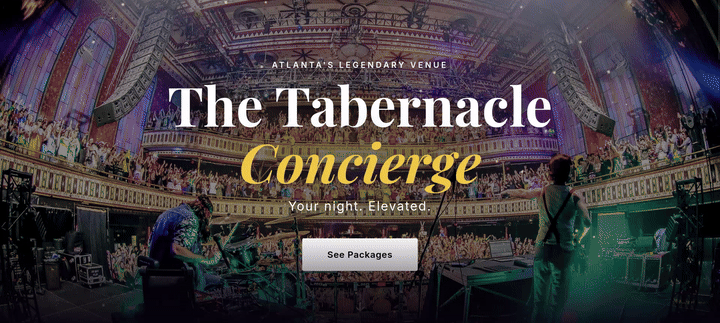

## Serendipity

Serendipity is always funny. It hits you when you are least expecting it.

I moved back to Atlanta a couple of years ago and finally made it a priority to get more involved in the local tech community. I've been using Luma to see what's happening around me, and when I noticed that [Technologists of Color](https://techsofcolor.org/) had an event centered around something called QuickBuild, I signed up immediately.

I quickly discovered the event was based on a show the founders of Technologists of Color participated in, so to prep, I binge-watched [The Full Stack](https://www.youtube.com/watch?v=8aHXhAlylQc&list=TLGGsdMfeQGT35gxOTA4MjAyNg), an AWS show where teams compete to build a company, create a brand, and launch a product under pressure. The 404 Arc-itects, ToC's own Jon Exume and Mark Lawson, had been competing all season using [Kiro](https://kiro.dev), an AI-powered development environment. Wanting to understand how others are using these tools, and getting to watch Jon and Mark compete on the show, was pretty cool context heading into the evening.

## The Night

The event was held at the Russell Innovation Center for Entrepreneurs, and the energy was right from the jump. After networking and food, we got an introduction to Kiro and the QuickBuild challenge was revealed: teams would have half an hour to build something worth demoing.

My brother Darryl, a final-year Mechanical Engineering student at Georgia Tech, and Lokesh, an Industrial Engineering student at Georgia Tech that we met that night, banded together with me and we took on the challenge. We even came up with a team name on the spot, **Tech Savvy**, because they're both at Georgia *Tech* and I'm in *tech*. It stuck 🎉

## The Build

Here's the thing: between the introduction, the ideating, and some break interruptions, we really only had about 15-20 consolidated minutes to build. The challenge prompt was simple. Draw notecards at random and build something around the words you pull.

We drew **The Tabernacle** and **Concierge Service**.

Immediately my mind went to the venue itself. That historic, ornate, legendary concert hall. I wanted to lean into the rock energy. Three.js floating particles simulating stage-light motes drifting up from the crowd. A moody dark aesthetic with gold accents. A synthesized guitar chord that fires off when someone signs up. The whole vibe.

Darryl helped guide the ideation and kept things minimal to make sure it was realistic. Not just flashy, but something a real user would actually believe in. Lokesh anchored us on the business pitch, helping to also frame what would visually sell to a concertgoer as well. The three tiers (Pre-Show at $75, VIP Night at $150, Full Experience at $300) came from that collaboration.

The tech stack ended up being:

- **Vite** for the dev server
- **Vanilla HTML/CSS/JS**, no framework overhead, just speed
- **Three.js** for the ambient particle effects
- **Web Audio API** for the guitar chord on form submission
- **Kiro** orchestrating the whole thing

And yes, I gratuitously got to add in NixOS to my workflow. Some things are non-negotiable. 😄

The full source is up on GitHub: [aws-quickbuild-challenge](https://github.com/cShirley14/aws-quickbuild-challenge). You can also check out the [live site](https://cshirley14.github.io/aws-quickbuild-challenge/).

## The Demo

The competition was light-hearted. Honestly, we were all just trying to make sure our apps *worked* and could show a user that they "signed up" and wanted to "sign up" for an experience. Every team brought something different to the table and it was genuinely fun seeing what people came up with under pressure.

I'm proud of what we accomplished. In 15 minutes, we went from random notecards to a polished landing page with scroll-reveal animations, tiered pricing, upcoming show listings, and a confirmation flow that *felt* like something real.

## After the Build

The judges (Kelsey Hightower, Jon Exume, and Mark Lawson) brought great energy evaluating everyone's projects. After demos wrapped, we all came together for the community watch party of The Full Stack season finale.

I even got to pick Jon Exume's brain afterward on how he used Kiro to ideate during the final round of the show. That kind of access to how people actually think through problems with AI tooling is invaluable.

## The Takeaway

In all, it was a great night. Big thanks to [AWS](https://aws.amazon.com/) for sponsoring the event. I'm grateful that Jon, Mark, and Kelsey let us all share that experience with them. The Technologists of Color community showed up. Developers, entrepreneurs, students, designers. The room was full of people who genuinely wanted to build.

Cheers to hopefully building things that bring joy, solve important problems, and leave the world better than we found it. 🚀

If you were there, let's connect. I'd love to keep the conversation going.
